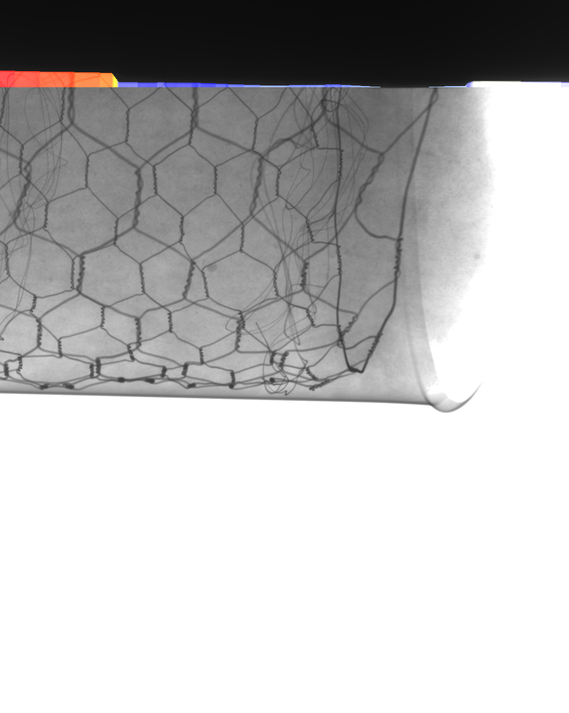

# Pipe Corrosion Detection

This project provides a Python-based solution for detecting corrosion in pipes using image processing techniques such as edge detection, contrast enhancement, and heatmap generation to highlight corrosion-prone areas in an image.

## Features
- **CLAHE (Contrast Limited Adaptive Histogram Equalization)**: Enhances the image contrast to make the detection robust against varying lighting conditions.
- **Gaussian Smoothing**: Reduces noise before edge detection to improve the accuracy of edge detection.
- **Canny Edge Detection**: Detects the edges of the pipe from an X-ray image.
- **Heatmap Generation**: Generates a heatmap based on the deviation of the detected pipe boundary from a reference line.

## Dependencies
- Python 3.x
- OpenCV (`cv2`)
- NumPy
- Matplotlib

You can install the necessary dependencies using pip:

```bash
pip install opencv-python numpy matplotlib
```
## Original Image and Corrosion Detected

<div style="display: flex; justify-content: space-around; align-items: center;">
  <div style="text-align: center; width: 45%;">
    <h3>Original Image</h3>
    
  </div>
  
  <div style="text-align: center; width: 45%;">
    <h3>Corrosion Detected</h3>
    
  </div>
</div>
